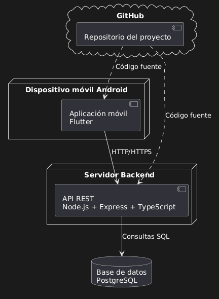

# AssistApp-Frontend
AsistApp es una app móvil para gestionar la asistencia de practicantes preprofesionales en laboratorios universitarios. Permite registrar entradas y salidas, validar asistencias, controlar tardanzas y aprobar horarios.

## Entorno de desarrollo
A continuacion listaremos las herramientas que usaremos para el desarrollo del app
### Flutter
Flutter es un Software Development Kit open source hecho por google. Es utilizado para la creacion de aplicaciones en distintas plataformas con un solo lenguaje de programacion (Dart). 
Utilizaremos Flutter en el proyecto para el desarrollo de la aplicacion.
### Android Studio
Android Studio es el Integrated Development Enviroment oficial para el desarrollo y testeo de aplicaciones en el sistema Android. Provee de herramientas para codigo, y un emulador de Android para poder hacer debugging y testing.
Utilizarems Android Studio en el proyecto para las pruebas de la aplicacion y verificacion de funcionamiento.
### Express.js
Express es un framework que construye sobre node.js para ofrecer herramientas que agilizan el desarrollo de la API del proyecto. 
Utilizaremos Express para el manejo de errores, el ingreso de sesion y la gestion de usuarios.
### PostgreSQL
PostreSQL es un sistema de manejo de base de datos con objetos relacionales. Es open source y se caracteriza por su integridad y flexibilidad. Soporta SQL y Json.
Utilizaremos PostgreSQL para el manejo de la base de datos que almacenara los datos de los usuarioa.

## Requerimientos funcionales
- Creacion de cuentas (Nombre, Rol, correo, contraseña)
- Diferenciacion entre cuenta de administrador y usuario
- Que el administrador pueda enviar invitaciones a sus trabajadores para crearse una cuenta
- Administrador puede colocar tiempo de entrada y salida esperado a cada usuario por cada dia de la semana
- Administrador puede colocar tiempo de gracia para ingreso
- Administrador puede editar tiempo de entrada y salida de cada usuario. (El admin y el usuario pueden ver si un tiempo ha sido editado de esta manera)
- Los usuarios pueden presionar un boton para marcar su ingreso y su salida
- El usuario puede ver su hora de ingreso y salida esperada de cada dia en un calendario
- El sistema determina automaticamente si un usuario ha cumplido con su horario o cuanto tiempo debe
- El administrador puede ver las horas de ingreso y salida de cualquier usuario en cualquier dia
- El usuario puede ver su record de asistencias del mes y cuantas horas debe
- El administrador puede imprimir un PDF con el resumen de asistencias del mes de cualquier usuario

## Requerimientos no funcionales

Los requerimientos no funcionales definen las características de calidad que debe cumplir AssistApp para funcionar correctamente, de forma segura y eficiente.

### Rendimiento
- La aplicación debe responder a las acciones del usuario en menos de 2 segundos en condiciones normales.
- El registro de entrada y salida debe procesarse de manera rápida para evitar retrasos en el control de asistencia.

### Seguridad
- El sistema debe proteger las cuentas de los usuarios mediante autenticación.
- Las contraseñas deben almacenarse de forma cifrada en la base de datos.
- La comunicación entre la aplicación móvil y el backend debe realizarse mediante HTTPS.

### Disponibilidad
- El backend debe estar disponible para que los usuarios puedan registrar sus asistencias durante sus horarios asignados.
- El sistema debe manejar múltiples usuarios registrando asistencia sin afectar el funcionamiento general.

### Usabilidad
- La interfaz debe ser clara e intuitiva para administradores y usuarios.
- El usuario debe poder registrar su ingreso o salida con pocos pasos.

### Compatibilidad
- La aplicación debe funcionar en dispositivos Android.
- La interfaz debe adaptarse correctamente a diferentes tamaños de pantalla.

### Persistencia de datos
- La información de usuarios, horarios y asistencias debe almacenarse en PostgreSQL.
- El sistema debe conservar el historial de asistencias para futuras consultas y reportes.

### Escalabilidad
- El backend desarrollado en Node.js con Express debe permitir agregar nuevas funcionalidades sin afectar la estructura principal del sistema.
- La arquitectura debe permitir separar la aplicación móvil, el servidor y la base de datos.

