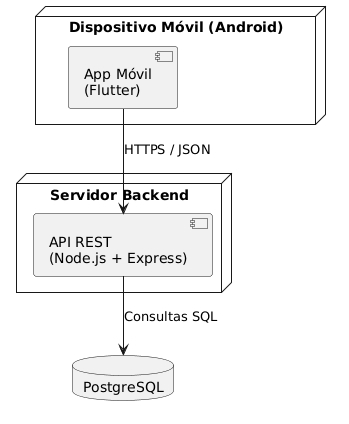
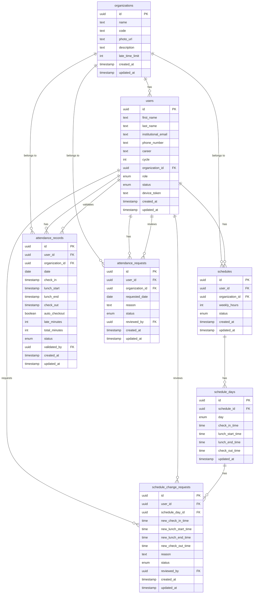

# AssistApp-Frontend
AsistApp es una aplicación móvil desarrollada con Flutter orientada a la gestión de asistencia de practicantes preprofesionales dentro de organizaciones. Permite a los practicantes registrar su asistencia diaria, proponer y ajustar horarios, justificar inasistencias y consultar su historial personal, todo desde su dispositivo móvil. Por su parte, administradores y validadores cuentan con herramientas para aprobar solicitudes de ingreso, confirmar registros de asistencia, gestionar cambios de horario y acceder a reportes individuales y analíticas generales del equipo.

## Entorno de desarrollo
A continuacion listaremos las herramientas que usaremos para el desarrollo del app
### Flutter
Flutter es un Software Development Kit open source hecho por google. Es utilizado para la creacion de aplicaciones en distintas plataformas con un solo lenguaje de programacion (Dart). 
Utilizaremos Flutter en el proyecto para el desarrollo de la aplicacion.
No se requiere la instalacion de Flutter pues puede ser trabajado en web.
### Android Studio
Android Studio es el Integrated Development Enviroment oficial para el desarrollo y testeo de aplicaciones en el sistema Android. Provee de herramientas para codigo, y un emulador de Android para poder hacer debugging y testing.
Utilizarems Android Studio en el proyecto para las pruebas de la aplicacion y verificacion de funcionamiento.
Para la instalacion de Android Studio, se descarga el installer desde la pagina oficial y se corre. Dentro, elegimos el google pixel 10 como emulador predeterminado.
### Express.js
Express es un framework que construye sobre node.js para ofrecer herramientas que agilizan el desarrollo de la API del proyecto. 
Utilizaremos Express para el manejo de errores, el ingreso de sesion y la gestion de usuarios.
Para la instalacion, primero se decarga node.js de su pagina oficial. Luego, se ingresa a la consola y se inserta "node -v". Luego, se abre un terminal en el folder donde quieras crear el proyecto y se escribe "npx express-generator [NombredelProyecto]" y dentro del folder del proyecto se ejecuta el comando "npm install".
### PostgreSQL
PostreSQL es un sistema de manejo de base de datos con objetos relacionales. Es open source y se caracteriza por su integridad y flexibilidad. Soporta SQL y Json.
Utilizaremos PostgreSQL para el manejo de la base de datos que almacenara los datos de los usuarios.
Para la instalacion, primero se descarga PostgreSQL de la pagina principal. Al ejecutar el instalador, en uno de los pasos se pide una contraseña para el superusuario. La contraseña debe ser guardada para futuras configuraciones. Luego, se le asigna un puerto. Con eso, se instala correctamente.
### Figma
Figma es una herramienta de diseño de interfaces colaborativa basada en la nube. Permite crear wireframes, prototipos interactivos y el diseño visual final de la aplicación.
No requiere de instalacion, puesto que es una herramienta de web.
## Diagrama de despliegue 

## Requerimientos no funcionales

Los requerimientos no funcionales definen las características de calidad que debe cumplir AssistApp para funcionar correctamente, de forma segura y eficiente.

### Rendimiento
- La aplicación debe responder a las acciones del usuario en menos de 2 segundos en condiciones normales.
- El registro de entrada y salida debe procesarse de manera rápida para evitar retrasos en el control de asistencia.

### Seguridad
- El sistema debe proteger las cuentas de los usuarios mediante autenticación.
- Las contraseñas deben almacenarse de forma cifrada en la base de datos.
- La comunicación entre la aplicación móvil y el backend debe realizarse mediante HTTPS.

### Disponibilidad
- El backend debe estar disponible para que los usuarios puedan registrar sus asistencias durante sus horarios asignados.
- El sistema debe manejar múltiples usuarios registrando asistencia sin afectar el funcionamiento general.

### Usabilidad
- La interfaz debe ser clara e intuitiva para administradores y usuarios.
- El usuario debe poder registrar su ingreso o salida con pocos pasos.

### Compatibilidad
- La aplicación debe funcionar en dispositivos Android.
- La interfaz debe adaptarse correctamente a diferentes tamaños de pantalla.

### Persistencia de datos
- La información de usuarios, horarios y asistencias debe almacenarse en PostgreSQL.
- El sistema debe conservar el historial de asistencias para futuras consultas y reportes.

### Escalabilidad
- El backend desarrollado en Node.js con Express debe permitir agregar nuevas funcionalidades sin afectar la estructura principal del sistema.
- La arquitectura debe permitir separar la aplicación móvil, el servidor y la base de datos.

---

## Diagrama de despliegue

---

## Diagrama de casos de uso

### Actor: Usuario

### Actor: Administrador

### Actor: Validador

### Actor: Practicante

---

## Descripción de casos de uso

A continuación se detalla cada caso de uso junto con el actor responsable y su descripción funcional. Los mockups de cada flujo se encuentran en el prototipo de Figma: [Ver prototipo en Figma](https://www.figma.com/design/4Uoegadii4QbM0yfaIX0XS/Logo-pmovil?t=WOXSwVpmNAQj3wrR-1)

| Código | Nombre | Actor | Descripción |
|--------|--------|-------|-------------|
| UC01 | Registrarse | Usuario | El usuario crea una nueva cuenta en el sistema proporcionando sus datos personales y credenciales de acceso. |
| UC02 | Iniciar sesión | Usuario | El usuario accede al sistema autenticándose con sus credenciales registradas. |
| UC03 | Cerrar sesión | Usuario | El usuario finaliza su sesión activa y es redirigido a la pantalla de inicio. |
| UC04 | Editar perfil | Usuario | El usuario actualiza su información personal, foto o datos de contacto dentro de su cuenta. |
| UC05 | Crear organización | Admin | El administrador registra una nueva organización en el sistema, configurando su nombre e información básica. |
| UC06 | Configurar organización | Admin | El administrador modifica los parámetros generales de la organización, como nombre, descripción o configuraciones de asistencia. |
| UC07 | Compartir código de invitación | Admin | El administrador genera y comparte un código único para que nuevos miembros soliciten unirse a la organización. |
| UC08 | Solicitar unirse a organización | Validador / Practicante | El usuario envía una solicitud de incorporación a una organización usando el código de invitación. |
| UC09 | Aceptar o rechazar solicitud | Admin | El administrador revisa las solicitudes de ingreso pendientes y decide aprobarlas o rechazarlas. |
| UC10 | Ver lista de miembros | Admin / Validador | El usuario visualiza el listado completo de integrantes activos de la organización con sus datos. |
| UC11 | Proponer horario de prácticas | Practicante | El practicante propone su horario semanal de prácticas para ser validado por un superior. |
| UC12 | Solicitar cambio de horario | Practicante | El practicante solicita una modificación a su horario de prácticas previamente aprobado. |
| UC13 | Aprobar o rechazar cambio de horario | Admin / Validador | El usuario revisa la solicitud de cambio de horario del practicante y emite una respuesta. |
| UC14 | Marcar asistencia diaria | Practicante | El practicante registra su entrada o salida en el sistema al inicio o fin de su jornada de prácticas. |
| UC15 | Confirmar registro de asistencia | Admin / Validador | El usuario verifica y confirma los registros de asistencia enviados por los practicantes. |
| UC16 | Solicitar registro de asistencia faltante | Practicante | El practicante solicita el registro de una asistencia que no pudo marcar en su momento, justificando el motivo. |
| UC17 | Aprobar o rechazar asistencia faltante | Admin / Validador | El usuario evalúa la justificación del practicante y decide si aprueba o rechaza el registro retroactivo. |
| UC18 | Ver historial de asistencia propio | Practicante | El practicante consulta su historial completo de asistencias registradas, incluyendo tardanzas y faltas. |
| UC19 | Ver reporte personal | Practicante | El practicante accede a un resumen estadístico de su desempeño y asistencia durante el periodo de prácticas. |
| UC20 | Ver reporte de practicante | Admin / Validador | El usuario consulta el reporte individual de asistencia y desempeño de un practicante específico. |
| UC21 | Ver analíticas generales | Admin / Validador | El usuario accede a un panel con métricas y estadísticas agregadas de todos los practicantes de la organización. |
| UC22 | Generar y descargar PDF | Practicante | El practicante exporta su reporte de asistencia en formato PDF para entregarlo como constancia. |
| UC23 | Ver registro de actividad | Admin | El administrador revisa el historial de acciones realizadas dentro del sistema por los miembros de la organización. |

## Diagrama de Base de datos

